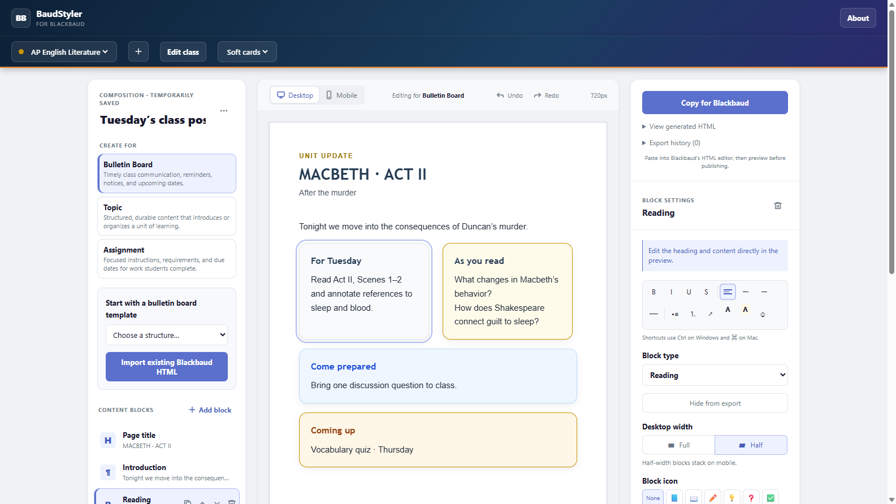
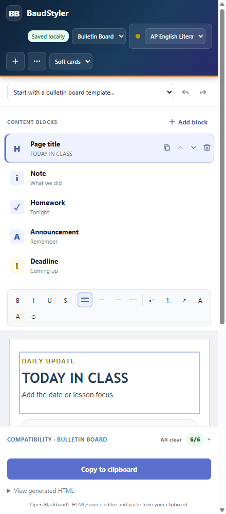

# BaudStyler

Create polished, structured class content and export inline-styled HTML that
survives Blackbaud's editor.

> **Private by design:** BaudStyler has no backend, accounts, analytics, or
> telemetry. Your drafts stay in your browser. The extension has no host
> permissions and cannot read or publish a Blackbaud page.

BaudStyler is not affiliated with, endorsed by, or produced by Blackbaud. It is
an independent tool for schools that use Blackbaud.

[Open the web composer](https://wildbil2me.github.io/assignment-styler/)



## Two ways to compose

The **web app** is the full editor: templates, HTML import, custom class styles,
saved posts, accessibility checks, and desktop/mobile previews.

The **Chrome and Edge side panel** is a focused quick-post workflow. Pick the
destination and class style, start from a template for that destination, edit the
blocks, copy the generated HTML, and paste it into Blackbaud's HTML/source
editor. It runs the same compatibility and contrast checks as the web app and
reports them the same way — collapsed, but never quieter.



Both shells use the same renderer, so the same blocks, profile, palette, and
surface produce the same HTML. BaudStyler supports 17 content block types, 15
templates, three visual profiles, six subject palettes, and bulletin, topic,
and assignment destinations.

## Install the extension locally

```bash
npm ci
npm run build:ext
```

Then:

1. Open `chrome://extensions` or `edge://extensions`.
2. Enable **Developer mode**.
3. Choose **Load unpacked** and select `extension-dist`.
4. Click the BaudStyler extension icon to open the side panel.
5. Compose and choose **Copy to clipboard**.
6. Paste into Blackbaud's HTML/source editor and preview before publishing.

The extension requests only `sidePanel` and `storage`. Storage holds the panel's
workspace locally; there is no content script and no Blackbaud host access. A
test pins that permission list so it cannot grow without someone noticing.

## Temporary saves and permanent backups

The web app stores its workspace in `localStorage`; the extension uses
`chrome.storage.local`. Browser origins are isolated, so their workspaces do not
automatically sync. BaudStyler treats all browser storage, including **My posts**,
as temporary because clearing browser data or reimaging a device can erase it.

Use **Back up workspace** often to download a permanent copy, and **Restore
workspace backup** to move it to another browser or recover it later. BaudStyler
cannot recover temporary saves because the project operates no server.

Both shells can do this: the web app from its post-actions menu, the side panel
from its **Workspace backup** section. In the panel it is the only way out —
nothing else can read `chrome.storage.local`, and removing the extension clears
it.

## Blackbaud compatibility

The renderer uses a 50-row compatibility probe; its original 41 rows were
measured across bulletin, topic, and assignment editors on one Blackbaud tenant.
It keeps all styles
inline, avoids structures Blackbaud strips, and can degrade decorative features
for a stricter tenant without dropping content.

Blackbaud configurations can vary. Other schools should run the included
tenant probe rather than assuming the recorded results apply to them. See
[the compatibility report](docs/blackbaud-compatibility.md) for the results,
limitations, and measurement procedure.

## Develop

Requires Node.js 22.13 or newer.

```bash
npm ci
npm run dev
```

The repository has two thin application shells over shared domain and UI code:

| Directory | Purpose |
| --- | --- |
| `core/` | Blocks, profiles, palettes, rendering, sanitizing, importing, checks, compatibility, and versioned storage |
| `ui/` | Shared React composer and quick-post interfaces |
| `apps/web/` | Static GitHub Pages shell |
| `apps/ext/` | MV3 side-panel shell |
| `tests/` | Contract, adversarial, migration, accessibility, and golden-output coverage |
| `tools/probe/` | Blackbaud compatibility probe generator and analyzer |

Run the complete local gate before submitting a change:

```bash
npm run check:release
npm run lint
npm test
npx tsc --noEmit
npm run build
npm run build:ext
```

Exported HTML is a tested contract. If a change intentionally alters it, update
the goldens deliberately and review their diff. Release steps and versioning are
documented in [docs/releasing.md](docs/releasing.md); notable changes live in
[CHANGELOG.md](CHANGELOG.md).

## License

[MIT](LICENSE)
